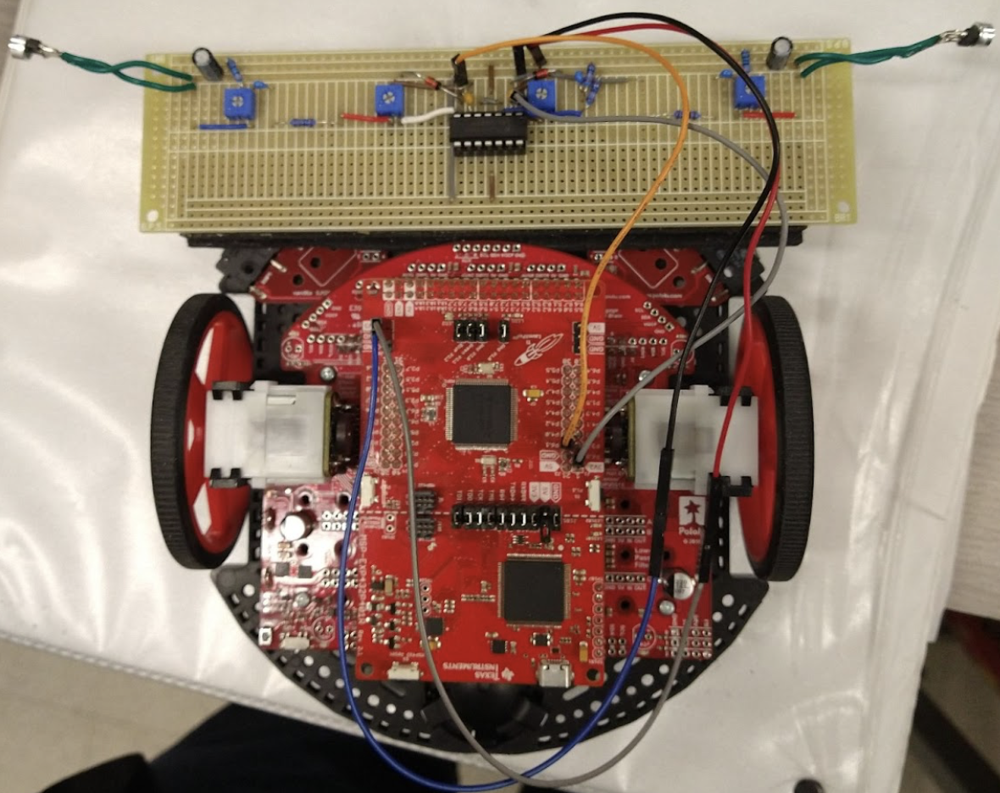
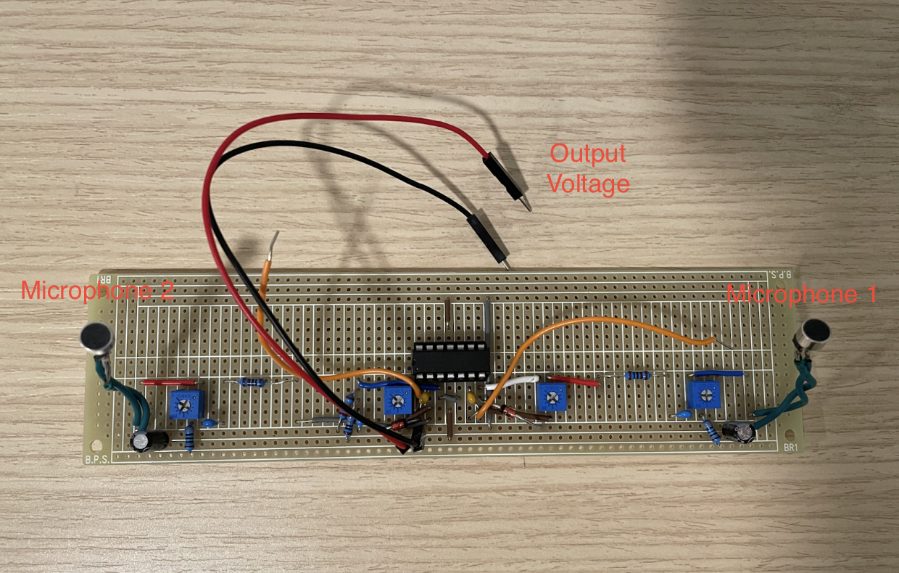
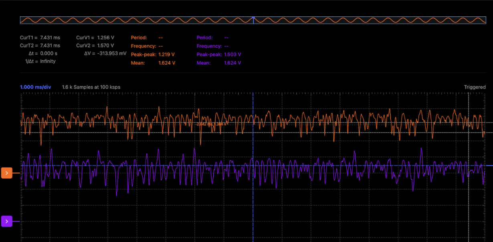
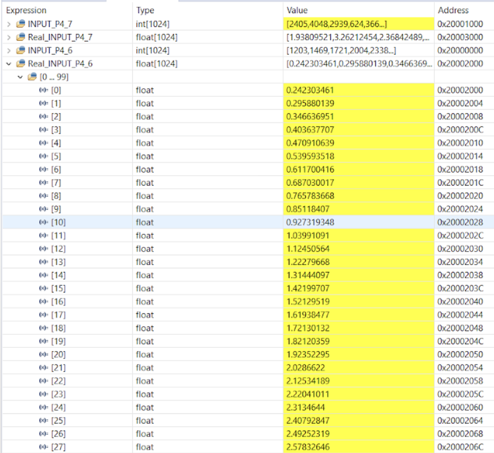
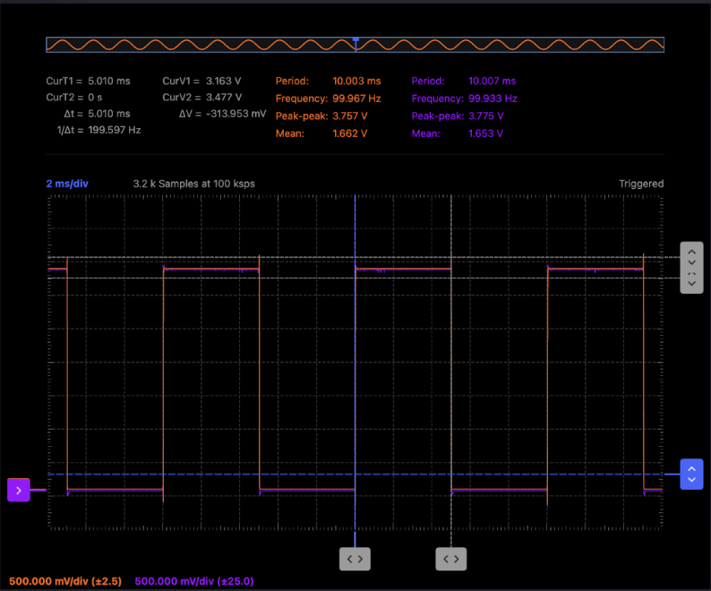
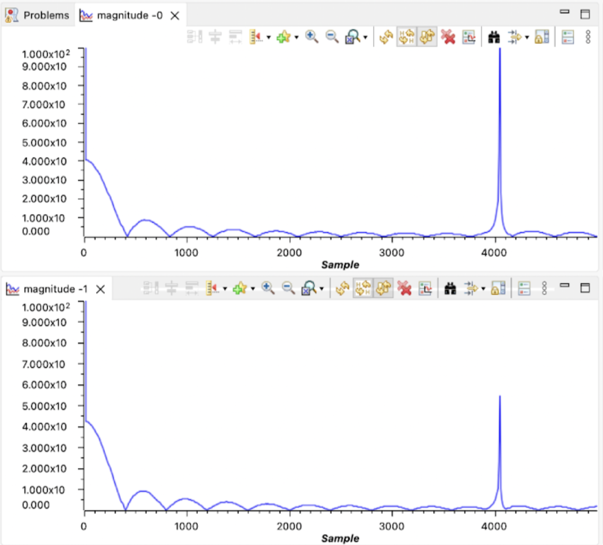
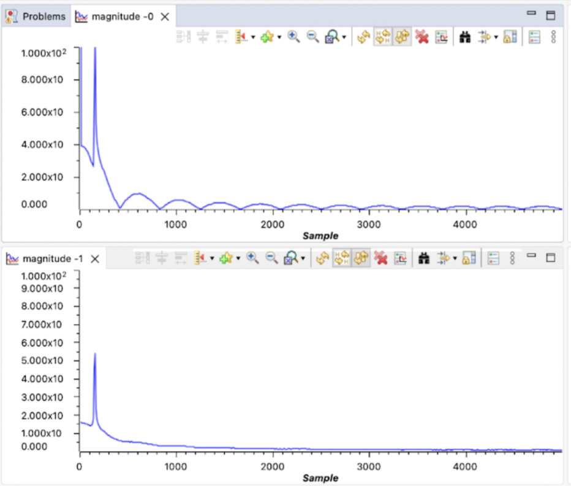

# P3_Sound_Follower

https://github.com/ttwag/P3_Sound_Follower/assets/113254272/8ed2ba37-40fd-48aa-8de7-3d279f86dcb7

In this project, me and my partner built a robot that follows sound source in real-time.

The image above shows the entire robot along with the added sound receiver circuit.

The video above shows how PWM signals could instruct the RSLK robot to move.

## Skills Involved
* C Language
* Embedded System Programming
* Soldering Circuit
* Basic Digital Signal Processing
* Using a Multimeter and Oscilloscope 

## Development Environment
I did this project with a teammate while I attended the class, [EEC10](https://ece.ucdavis.edu/course-catalog), at UC Davis.

This project uses the Texas Instrument's RSLK Learning Kit, and we programmed them in TI's [Code Composer Studio](https://www.ti.com/tool/CCSTUDIO)

The analog sound receiver (yellow board in the picture) was soldered by me and my teammate.

## Summary
We build an analog sound receiver circuit that converts the environment's sound into a voltage waveform, and then the analog-to-digital converter in the microcontroller samples the analog waveform into digital values. We programmed the microcontroller to digitally filter out the low and high-frequency sampled values and calculate the direction where the highest values come from. It then moves toward that direction by sending a pulse-width modulated signal to the motor.

## Microphone Receiver Circuit

The sound receiver circuit has two microphones that convert sound waves into voltage waves.

It contains an analog active band-pass filter that filters out the high and low-frequency noise in the voltage waveform and amplifies the waveform.

### Output from the microphone receiver circuit on an oscilloscope. 

### Output Sampled by the Microcontroller
Sampling Frequency: $2 \space kHz$

Sample Size: $100$

## Pulse-Width Modulated (PWM) Signal
The image below shows the PWM signal with a 50% duty cycle on an oscilloscope.
It's the signal that will control the motor.

## Digital Band-Pass Filter
To digitally process the sampled values with a band-pass filter, we could process it with a low-pass filter and then a high-pass filter just like we would cascade them in analog circuits.
### Digital Low-Pass Filter
The image below shows the Fast Fourier Transform (FFT) of the sampled values before (top) and after (bottom) the digital low-pass filter.

The cut-off frequency is 3000 Hz, so we see that high-frequency magnitude such as 4000 Hz is attenuated.

### Digital High-Pass Filter
On the contrary, the high-pass filter filters out the low-frequency signal.

The image below shows the FFT of the sampled values before (top) and after (bottom) the digital high-pass filter.

The cut-off frequency is 200 Hz, so we see that low-frequency magnitude such as 150 Hz in the image is attenuated.

## What Could I Do Better?
The analog receiver circuitry was not very good at giving consistent results. The inconsistency made the digital programming part extremely difficult. A good thing to do in the future is to ensure the symmetry between the two microphone circuits and maybe build more of them to achieve an extremely well-tuned circuit.

To determine if the sound source was in front of the microphone, the team thought of comparing the sound difference between the two microphones. If they were small enough, then the sound should be at the center. 

However, the sound difference between the left and right microphones was amplified when the robot got closer to the speaker, making it hard to determine the threshold since it’s a function of position and the speaker’s sound level. 

One way to solve this problem could be to set the threshold as a percentage of the input average sound and only compare the percentages.
## File Structure and Dependencies
* The overall structure of the program is in main.c, but it doesn't contain the entire program.
* This program requires numerous TI drivers and libraries.
## Helpful Links
You can learn more about the library function [here](https://software-dl.ti.com/msp430/msp430_public_sw/mcu/msp430/MSP432_Driver_Library/3_21_00_05/exports/driverlib/msp432_driverlib_3_21_00_05/doc/MSP432P4xx/html/driverlib_html/modules.html)
